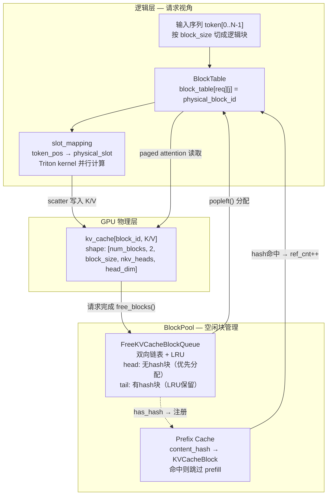
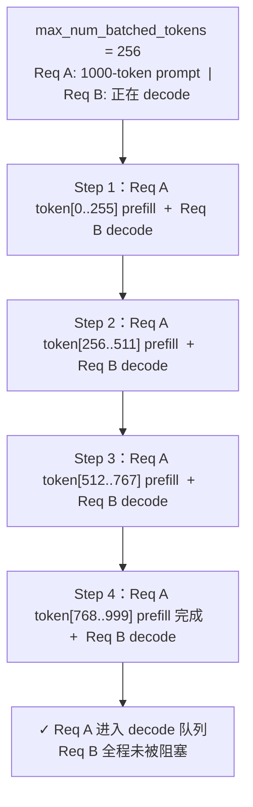

# vllm v1 源码精读（三）：KV Cache 管理、Chunked Prefill 与异步架构

> **本文基于 vllm `ba22152`（2026-07-06），源码链接均指向该 commit 的固定行号。**
> 代码浏览入口：[github.com/vllm-project/vllm/tree/ba22152](https://github.com/vllm-project/vllm/tree/ba22152096b2484faa3579624a253d54804d876d)

**系列文章**：
- [（一）为什么要重写，以及 LLM() 这行代码背后发生了什么](https://marsggbo.github.io/blog/2026/20260706-vllm-v1-01-arch/)
- [（二）generate() 计算流——model.forward() 在哪里被调用？](https://marsggbo.github.io/blog/2026/20260706-vllm-v1-02-generate/)
- **（三）KV Cache 管理、Chunked Prefill 与异步架构**（本文）
- [（四）插件系统——用 Python entry_points 实现零侵入扩展](https://marsggbo.github.io/blog/2026/20260706-vllm-v1-04-plugins/)
- [（五）从 generate() 到 Speculative Decoding 的完整计算流](https://marsggbo.github.io/blog/2026/20260709-vllm-v1-05-speculative-decoding/)

---

## 1. 前言

上一篇把 `EngineCore.step()` 的调用链走了一遍：调度 → GPU forward → 采样 → 状态更新。那篇文章故意跳过了"调度"内部的细节——因为 KV Cache 管理、Chunked Prefill 和异步架构这三块放在一起讲更清楚。

这三块是相互咬合的：调度器靠 `KVCacheManager` 决定哪些请求能跑；Chunked Prefill 改变了调度器的分配逻辑；HTTP serving 的独立进程架构影响了调度器和执行器的通信方式。单独看任何一块都有点懵，所以这篇文章先给整体模块关系，再往里走。

---

## 2. 整体架构：三个模块如何咬合

读懂后面细节的前提，是先搞清楚哪些模块在做什么事、它们之间怎么连接。

vllm v1 里，KV Cache 相关的核心逻辑分布在三个模块：

- **`KVCacheManager`**（`vllm/v1/core/kv_cache_manager.py`）：纯 CPU 侧的逻辑块管理器，维护"哪些物理块空闲、哪些被占用、前缀缓存里有什么"。它不接触 GPU，只管块的分配、释放、查找
- **`Scheduler`**（`vllm/v1/core/sched/scheduler.py`）：持有 `KVCacheManager`，每步调度时询问"这个请求能分到块吗"，拿到答案后决定哪些请求进 running 队列
- **`GPUModelRunner`**（`vllm/v1/worker/gpu_model_runner.py`）：执行侧，把调度器输出的逻辑块编号（block table）转换成 GPU 上的物理槽位（slot_mapping），喂给 FlashAttention

三者的调用关系是：

```python
# EngineCore.__init__()  —  vllm/v1/engine/core.py:99
self.kv_cache_manager = KVCacheManager(vllm_config, num_gpu_blocks)
self.scheduler = Scheduler(vllm_config, self.kv_cache_manager)  # 调度器持有 manager

# Scheduler.schedule()  —  每步调度时
computed = self.kv_cache_manager.get_computed_blocks(request)       # 查前缀缓存
ok = self.kv_cache_manager.allocate_slots(request, num_new_tokens)  # 分配新块
if not ok:
    self._preempt(request)   # 没块了，踢回等待队列

# GPUModelRunner._prepare_inputs()  —  执行时
slot_mapping = compute_slot_mapping(block_table, seq_lens)           # 逻辑块 → 物理槽位
attn_metadata = FlashAttentionMetadataBuilder.build(
    block_table=block_table_gpu, slot_mapping=slot_mapping, ...)
```

**关键分工**：`KVCacheManager` 只管"逻辑层"——哪些块被谁占着，内容 hash 是什么；`GPUModelRunner` 才做"物理层"翻译——把逻辑块编号映射到 GPU tensor 的实际偏移量。两层之间的桥梁是 `block_table`（一个 CPU numpy 数组，调度后异步 H2D 拷贝到 GPU）。

有了这个全景，接下来逐层往里走。

---

## 3. KV Cache 为什么要分块管理

先把 PagedAttention 要解决的问题说清楚，不然后面那些数据结构看起来会很无聊。

LLM 推理的显存大头其实是 KV Cache，不是模型权重。以 LLaMA-3-8B（GQA，8 个 KV head，head_dim=128，fp16）为例：

- 每层每个 token 的 KV Cache：$2 \times 8 \times 128 \times 2\ \text{bytes} = 4096\ \text{bytes}$
- 32 层合计：$32 \times 4096 = 131072$ bytes ≈ **128 KB/token**
- 一个 4K 上下文的请求：$4096 \times 128\ \text{KB} \approx 512\ \text{MB}$

batch 里有 10 个这样的请求，仅 KV Cache 就需要 5 GB。更头疼的是，不同请求的实际序列长度差异很大。如果每个请求都预分配"最长可能序列"的显存，内存碎片极其严重——可能 80% 的显存在某个时刻是空闲的，却没法给其他请求用。

**PagedAttention 的思路和操作系统虚拟内存分页几乎一模一样**：把 KV Cache 切成固定大小的"页"（块），物理上不连续，用地址表（block table）维护逻辑序列到物理块的映射。理解了 OS 的虚拟内存，这套设计的动机就一目了然。

---

## 4. KV Cache 数据结构：从最小单元到管理器

搞清楚了 why，来看 how。vllm 的 KV Cache 数据结构分三层：

1. **`KVCacheBlock`**：最小单元，对应 GPU tensor 上的一个物理块
2. **`FreeKVCacheBlockQueue`**：管理所有空闲块，维护 LRU 淘汰策略
3. **`BlockTable`** + **`slot_mapping`**：连接逻辑序列和 GPU 物理槽位

三层之间的数据流如下图。左侧是逻辑层（请求视角），右侧是块池（管理器视角），底部是 GPU 物理层：



图里有三条主线：

- **分配链**：请求来了 → `FreeKVCacheBlockQueue.popleft()` 取空闲块 → 填到 `BlockTable` → 用 `slot_mapping` 写入 GPU
- **前缀复用链**：`Prefix Cache` hash 命中 → 直接复用 `BlockTable` 里已有的物理块，跳过这些 token 的 prefill
- **释放链**：请求完成 → 物理块归还 `FreeKVCacheBlockQueue`，有 hash 的进 tail（LRU 保留），无 hash 的进 head（优先再分配）

下面逐层看细节。

### 4.1 KVCacheBlock：最小单元

```python
# KVCacheBlock  —  vllm/v1/core/kv_cache_utils.py
class KVCacheBlock:
    block_id: int                           # 物理块编号（0..num_blocks-1）
    ref_cnt: int                            # 引用计数
    _block_hash: BlockHashType | None       # 内容 hash（None = 还没填满）
    prev_free_block: KVCacheBlock | None    # 双链表指针
    next_free_block: KVCacheBlock | None
```

每个 `KVCacheBlock` 对应 GPU 上 KV Cache tensor 里的一个切片：

```python
# shape: [num_blocks, 2, block_size, num_kv_heads, head_dim]
kv_cache[block_id, 0]  # K cache，shape [block_size, nkv, d]
kv_cache[block_id, 1]  # V cache，shape [block_size, nkv, d]
```

逻辑上，一个请求的 KV Cache 是一段连续序列；物理上，它被切成若干个 `KVCacheBlock`，散布在 GPU 显存的任意位置。连接逻辑和物理的，是 block table。

### 4.2 FreeKVCacheBlockQueue：LRU 双链表

`FreeKVCacheBlockQueue` 维护所有 `ref_cnt == 0` 的块，是整个 KV Cache 管理里最关键的数据结构：

```
head → [无hash块] → [无hash块] → [有hash块] → [有hash块] → tail
       ↑ 优先被分配                              ↑ 尽量保留（前缀缓存）
```

四种操作全是 O(1)：

| 操作 | 场景 | 位置 |
|---|---|---|
| `popleft()` | 分配新块 | 从 head 取 |
| `appendleft()` | 释放无 hash 块 | 到 head（无缓存价值，优先再用） |
| `append()` | 释放有 hash 块 | 到 tail（LRU 策略，尽量晚被驱逐） |
| `remove(block)` | 前缀缓存命中 | 从中间摘出 |

**为什么用双链表而不是 `deque`？** 前缀缓存命中时，需要把被命中的块从 free list **中间**移除——它从空闲状态变为被占用。`deque` 中间移除是 O(n)，双链表保存了前后指针，O(1) 就能摘出来。和 OS LRU 页面置换用双链表是同一个道理，做过 LeetCode 146（LRU Cache）的话这里应该很熟悉。

### 4.3 块的完整生命周期

```
分配（allocate_slots）：
  get_new_blocks(n) → popleft() × n
  → 如果取到的块有 hash（是前缀缓存），先从 prefix_cache_map 中移除
  → block.ref_cnt = 1

前缀缓存命中（get_computed_blocks → touch）：
  if block.ref_cnt == 0:
      free_queue.remove(block)   # 从 free list 中间取出
  block.ref_cnt += 1

释放（free_blocks）：
  block.ref_cnt -= 1
  if ref_cnt == 0:
      if no hash:  free_queue.appendleft(block)   # 头部，优先再用
      if has hash: free_queue.append(block)       # 尾部，LRU 保留

哈希注册（cache_blocks）：
  block._block_hash = compute_hash(token_ids, parent_hash)
  prefix_cache_map[block_hash] = block
```

---

## 5. Block Table 和 slot_mapping：从逻辑块到 GPU 物理槽

`KVCacheManager` 管的是"哪个逻辑块用哪个物理 block_id"，但 attention kernel 需要更细的粒度——**每个 token 具体写入哪个物理槽**。这一步的转换靠 Block Table 和 slot_mapping 完成。

下图展示了从 block_table 到 slot_mapping 的计算过程，以及 FlashAttention 如何用这两个结构读写 KV：


**Block Table**（`vllm/v1/worker/block_table.py`）是一个 CPU 侧 pinned numpy 数组，每步调度后异步 H2D 拷贝到 GPU：

```python
block_table: np.ndarray   # shape [max_num_reqs, max_num_blocks_per_req], dtype int32
# block_table[req_i][j] = 请求 i 第 j 个逻辑块对应的物理 block_id
```

有了 block table，**slot_mapping** 进一步细化到每个 token 对应的具体物理槽：

$$\text{slot\_id} = \text{block\_table}[\text{req}][\lfloor\text{pos} / B\rfloor] \times B + (\text{pos} \bmod B)$$

$B$ 是 `block_size`，`pos` 是 token 在请求中的绝对位置。这个映射由 Triton kernel 并行计算，输出一个 `[N_tokens]` 的 1D tensor。

FlashAttention 2/3 原生支持 paged KV，所以实际用起来很干净：

```python
# vllm/v1/attention/backends/flash_attn.py  FlashAttentionImpl.forward()
# 写：把新计算的 K/V scatter 写入 KV cache
ops.reshape_and_cache_flash(key, value, key_cache, value_cache, slot_mapping, ...)

# 读：FlashAttention 直接用 block_table 做 paged attention
# 不需要先 gather 成连续 buffer，避免了一次额外拷贝
flash_attn_varlen_func(q=query, k=key_cache, v=value_cache,
                       block_table=block_table_gpu, ...)
```

---

## 6. Prefix Caching：system prompt 不用重复计算

有了 block table 和 slot_mapping，KV Cache 的读写问题解决了。但还有个效率问题没处理：system prompt 通常很长（几百到几千 token），如果每个用户请求都带着同一个前缀，每次都重新 prefill 既浪费算力又慢。

Prefix caching 的思路：**只要两个请求的 token 前缀完全相同，对应的 KV 块可以直接复用，不需要重新计算**。

判断"是否相同"靠块 hash——**块 hash 是滚动计算的**：

```python
# hash_request_tokens()  —  vllm/v1/core/kv_cache_utils.py（伪代码）
# 第 k 块的 hash = f(token_ids_k, parent_hash_{k-1})
```

这个滚动 hash 保证：只要前缀 token 完全一致，无论这些块被分配到哪个物理位置，对应的 hash 都相同。

**查询时要求前缀连续命中**（一旦 miss 就停，不跳过）：

```python
# KVCacheManager.get_computed_blocks()  —  vllm/v1/core/kv_cache_manager.py:110
def get_computed_blocks(request):
    computed = []
    for block_hash in request.block_hashes:
        block = prefix_cache_map.get(block_hash)
        if block is None:
            break   # 前缀必须连续，一旦 miss 就停
        computed.append(block)
    return computed
```

命中后，`request.num_computed_tokens` 直接跳到命中块数 × block_size，本次调度跳过这些 token 的 prefill。

**前缀缓存在哪里更新**：每步 `update_from_output()` 之后，被完整填满的块（内容确定了）会计算 hash 并写入 `prefix_cache_map`。

下图展示了 KV Cache 分配到释放的完整时序，包括前缀缓存命中的路径：


> **一个容易被忽视的细节**：被抢占（preemption）的请求，其 KV 块释放后，如果这些块有 hash（内容完整），它们会进入 LRU 尾部等待驱逐，而不是立即消失。如果这期间显存够用，下次同一请求重新被调度时，前缀缓存可能还在，只需重新 prefill 新增的部分。**被抢占不等于"从头来"。**

---

## 7. Chunked Prefill：prefill 和 decode 为什么能同框

前面解决了"KV Cache 怎么管"。现在来看另一个问题：有一个 10000 token 的长 prompt，一次性 prefill 需要 GPU 独占几秒，这期间所有正在 decode 的请求全部卡住，用户侧看到的就是一段时间完全没有输出——TTFT 被严重拖长。

### 7.1 v0 的问题根源

v0 里，prefill 和 decode 是两个独立阶段，交替执行：一批全部 prefill 完，再切到 decode。**一个长 prompt 就能把所有 decode 请求饿死**。另一个副作用是 GPU 利用率不稳定——prefill 阶段 compute-bound，decode 阶段 memory-bound，两者交替切换，GPU 无法稳定在最优工作点。

### 7.2 v1 的解法：num_computed_tokens

v1 删掉了 prefill/decode 的阶段概念，**每个请求只有一个字段 `num_computed_tokens`**（"已经过 forward pass 的 token 数"）：

- `num_computed_tokens == 0` → 需要从头 prefill
- `0 < num_computed_tokens < prompt_len` → prefill 进行中（分 chunk 中）
- `num_computed_tokens == prompt_len` → 进入 decode

调度器每步用 `token_budget` 控制总处理量：

```python
# Scheduler.schedule()  —  vllm/v1/core/sched/scheduler.py:396（精简）
for request in self.waiting:
    remaining = len(request.prompt_token_ids) - request.num_computed_tokens
    num_new = min(remaining, remaining_token_budget)   # 自动 chunk
    
    if not enable_chunked_prefill and num_new < remaining:
        break   # 不支持 chunk：要整个 prefill 进来，否则等
    
    remaining_token_budget -= num_new
    # 分配 KV 块，移入 running
```

下图展示了 Req A（1000-token prompt）被切成 4 步之后，每步 batch 的组成——Req B 的 decode 全程没有被阻塞：



> **token_budget 怎么设？** `max_num_batched_tokens` 控制每步最多处理多少 token（prefill + decode 合计）。设太小，长 prompt 的 prefill 被切很碎，TTFT 变慢；设太大，GPU 单步计算量过大，latency 抖动。官方建议从 2048~8192 开始，根据目标 latency SLO 和 GPU 显存决定。

### 7.3 抢占：KV Cache 不够怎么办

调度器发现 KV Cache 不够给 running 队列用时，会**抢占**优先级最低的请求：

```python
# Scheduler._preempt()  —  vllm/v1/core/sched/scheduler.py
def _preempt(self, request):
    self.kv_cache_manager.free(request)   # 释放 KV 块
    request.num_computed_tokens = 0       # 重置进度
    request.status = RequestStatus.PREEMPTED
    self.running.remove(request)
    self.waiting.add(request)             # 回到等待队列
    # output_token_ids 保留：下次重新 prefill 时带上已生成的 output
```

被抢占的请求下次调度时需要重新 prefill（prompt + 已生成的 output），代价较高。所以调度器有 watermark 机制：只有 `free_blocks > watermark` 时才允许新请求准入，提前留缓冲。

---

## 8. 异步架构：AsyncLLM + ZMQ 前后端分离

KV Cache 和调度逻辑说清楚了。最后一块是 HTTP serving 的架构问题——它和前面两块有一个共同的根源：Python GIL。

离线推理用 `LLM` 类，HTTP serving 用 `AsyncLLM`（`vllm/v1/engine/async_llm.py`）。两者最大的区别是通信架构。

### 8.1 为什么要独立进程

HTTP server 是 asyncio 驱动（IO 密集型），EngineCore 是调度 + GPU 执行（CPU/GPU 密集型）。如果在同一进程里，两者会频繁争抢 GIL，互相拖慢——asyncio 事件循环在等网络 IO 时，理论上应该让 EngineCore 跑，但 EngineCore 里有大量 Python 调度逻辑，频繁争 GIL，结果两边都磕磕绊绊。

**解法是把 EngineCore 放到独立进程**，独立进程之间没有 GIL 限制，两边真正并行。进程间通信用 ZMQ（ZeroMQ，高性能异步消息队列）+ msgpack（比 pickle 轻量的序列化协议）。

下图是完整的通信时序，展示从 HTTP 请求进来到逐 token 流式输出的全链路：


### 8.2 ZMQ 通信协议

消息格式：单字节类型标识 + msgpack payload

| 类型字节 | 含义 | 方向 |
|---|---|---|
| `\x00` ADD | 新请求 | 前端 → EngineCore |
| `\x01` ABORT | 中止请求 | 前端 → EngineCore |
| `\x05` WAKEUP | 有新请求，唤醒 EngineCore | 前端 → EngineCore |
| (PUB) | EngineCoreOutputs | EngineCore → 前端 |

EngineCore 用 ZMQ PUB/SUB 模式：每完成一个 step 就 publish 这一步所有请求的新 token；前端是 subscriber，收到后立即 detokenize 并 yield 给 HTTP 层。

### 8.3 流式输出的实现

```python
# AsyncLLM.generate()  —  vllm/v1/engine/async_llm.py
async def generate(self, prompt, sampling_params, request_id):
    await self.engine_core.add_request(EngineCoreRequest(...))
    
    async for output in self._result_handler.get_output(request_id):
        yield output   # 每生成一个 token 就推一次给 HTTP client
```

HTTP server 用 SSE（Server-Sent Events）把每次 `yield` 的内容推给客户端——这就是 OpenAI API `stream=True` 时逐 token 输出的底层实现。**整个链路没有轮询，完全事件驱动**：EngineCore 每完成一个 step 就 PUB 推送，前端 SUB 收到后立即转发给 HTTP client。

---

## 9. 小结

把三块串起来：

**KV Cache 管理**：`KVCacheManager` 维护逻辑块的分配/释放/前缀缓存（纯 CPU 侧）；`GPUModelRunner` 把逻辑块编号翻译成 slot_mapping，喂给 FlashAttention（GPU 侧）。两层之间的桥梁是 block_table。`FreeKVCacheBlockQueue` 是 LRU 双链表，O(1) 支持四种操作（popleft 分配、appendleft 释放无 hash 块、append 释放有 hash 块、remove 前缀缓存命中时中间摘出）。

**Chunked Prefill**：v1 用 `num_computed_tokens` 替代 prefill/decode 阶段标记，调度器每步按 `max_num_batched_tokens` 切 chunk，prefill 和 decode 在同一个 batch 里混排执行，解决了 v0 里长 prompt 饿死 decode 请求的问题。

**异步架构**：`AsyncLLM` 把 EngineCore 放到独立进程，用 ZMQ PUB/SUB 通信，绕开 Python GIL，HTTP server 和 GPU 执行真正并行。每步完成就 PUB，前端 SUB 后立即推给 HTTP client，全链路事件驱动。

**遇到问题去哪找**（完整版）：

| 问题场景 | 代码位置 |
|---|---|
| 多 GPU 启动 / NCCL 报错 | `vllm/v1/executor/multiproc_executor.py` |
| 模型加载失败 | `vllm/model_executor/model_loader.py` |
| 显存不够 / KV Cache 分配失败 | `EngineCore._initialize_kv_caches()` |
| OOM during forward | `GPUModelRunner.execute_model()`，检查 `max_num_batched_tokens` |
| Sampling 结果异常 | `vllm/v1/sample/sampler.py` |
| 输出乱码 | `IncrementalDetokenizer`，检查 tokenizer 匹配 |
| Attention 报错 | `vllm/v1/attention/backends/flash_attn.py` |
| HTTP server 延迟高 | `AsyncLLM` 的 ZMQ 通信，检查 EngineCore 进程是否正常 |
| Chunked prefill 相关 | `vllm/v1/core/sched/scheduler.py`，检查 `max_num_batched_tokens` |
| 前缀缓存没有命中 | `KVCacheManager.get_computed_blocks()`，检查 block_hashes 计算 |

---

> 另外，我们团队最近出版了[《动手学 AutoML：从 NAS 到大语言模型优化实战》](https://item.jd.com/14945889.html)，感兴趣的话可以看看。
>
> 
